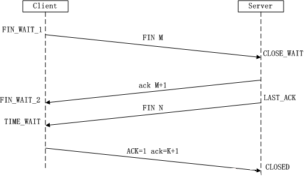

# 计算机网络

### 什么是三次握手？

- 第一次握手：Client将SYN置1，随机产生一个初始序列号seq发送给Server，进入SYN_SENT状态；
- 第二次握手：Server收到Client的SYN=1之后，知道客户端请求建立连接，将自己的SYN置1，ACK置1，产生一个acknowledge number=sequence number+1，并随机产生一个自己的初始序列号，发送给客户端；进入SYN_RCVD状态；
- 第三次握手：客户端检查acknowledge number是否为序列号+1，ACK是否为1，检查正确之后将自己的ACK置为1，产生一个acknowledge number=服务器发的序列号+1，发送给服务器；进入ESTABLISHED状态；服务器检查ACK为1和acknowledge number为序列号+1之后，也进入ESTABLISHED状态；完成三次握手，连接建立。

##### TCP建立连接可以两次握手吗？为什么?

展开

不可以。可能会出现以下情况：**已失效的连接请求报文段又传到了服务器端**。

> client 发出的第一个连接请求报文段并没有丢失，而是在某个网络结点长时间的滞留了，以致延误到连接释放以后的某个时间才到达 server。本来这是一个早已失效的报文段。但 server 收到此失效的连接请求报文段后，就误认为是 client 再次发出的一个新的连接请求。于是就向 client 发出确认报文段，同意建立连接。假设不采用 “三次握手”，那么只要 server 发出确认，新的连接就建立了。由于现在 client 并没有发出建立连接的请求，因此不会理睬 server 的确认，也不会向 server 发送数据。但 server 却以为新的运输连接已经建立，并一直等待 client 发来数据。这样，server 的很多资源就白白浪费掉了。采用 “三次握手” 的办法可以防止上述现象发生。例如刚才那种情况，client 不会向 server 的确认发出确认。server 由于收不到确认，就知道 client 并没有要求建立连接。

##### 可以采用四次握手吗？为什么？

展开

可以。但是会降低传输的效率。

四次握手是指：第二次握手：Server只发送ACK和acknowledge number；而Server的SYN和初始序列号在第三次握手时发送；原来协议中的第三次握手变为第四次握手。出于优化目的，四次握手中的二、三可以合并。

##### 第三次握手中，如果客户端的ACK未送达服务器，会怎样？

展开

由于Server没有收到ACK确认，因此会重发之前的SYN+ACK（默认重发五次，之后自动关闭连接），Client收到后会重新传ACK给Server。

如果Client向服务器发送数据，服务器会以RST包响应。

##### 如果已经建立了连接，但客户端出现了故障怎么办？

展开

服务器每收到一次客户端的请求后都会重新复位一个计时器，时间通常是设置为2小时，若两小时还没有收到客户端的任何数据，服务器就会发送一个探测报文段，以后每隔75秒钟发送一次。若一连发送10个探测报文仍然没反应，服务器就认为客户端出了故障，接着就关闭连接。

##### 初始序列号是什么？

展开

TCP连接的一方A，随机选择一个32位的序列号（Sequence Number）作为发送数据的初始序列号（Initial Sequence Number，ISN），比如为1000，以该序列号为原点，对要传送的数据进行编号：1001、1002...三次握手时，把这个初始序列号传送给另一方B，以便在传输数据时，B可以确认什么样的数据编号是合法的；同时在进行数据传输时，A还可以确认B收到的每一个字节，如果A收到了B的确认编号（acknowledge number）是2001，就说明编号为1001-2000的数据已经被B成功接受。

### 什么是四次挥手？

- 第一次挥手：Client将FIN置为1，发送一个序列号seq给Server；进入FIN_WAIT_1状态；
- 第二次挥手：Server收到FIN之后，发送一个ACK=1，acknowledge number=收到的序列号+1，同时发送一个自己的序列号；进入CLOSE_WAIT状态。此时客户端已经没有要发送的数据了，但仍可以接受服务器发来的数据。
- 第三次挥手：Server将FIN置1，发送一个序列号给Client；进入LAST_ACK状态；
- 第四次挥手：Client收到服务器的FIN后，进入TIME_WAIT状态；接着将ACK置1，发送一个acknowledge number=序列号+1给服务器；服务器收到后，确认acknowledge number后，变为CLOSED状态，不再向客户端发送数据。客户端等待2*MSL（报文段最长寿命）时间后，也进入CLOSED状态。完成四次挥手。

##### 为什么不能把服务器发送的ACK和FIN合并起来，变成三次挥手（CLOSE_WAIT状态意义是什么）？

展开

因为服务器收到客户端断开连接的请求时，可能还有一些数据没有发完，这时先回复ACK，表示接收到了断开连接的请求。等到数据发完之后再发FIN，断开服务器到客户端的数据传送。

##### 如果第二次挥手时服务器的ACK没有送达客户端，会怎样？

展开

客户端没有收到ACK确认，会重新发送FIN请求。

##### 客户端TIME_WAIT状态的意义是什么？

展开

第四次挥手时，客户端发送给服务器的ACK有可能丢失，TIME_WAIT状态就是用来重发可能丢失的ACK报文。如果Server没有收到ACK，就会重发FIN，如果Client在2*MSL的时间内收到了FIN，就会重新发送ACK并再次等待2MSL，防止Server没有收到ACK而不断重发FIN。

MSL(Maximum Segment Lifetime)，指一个片段在网络中最大的存活时间，2MSL就是一个发送和一个回复所需的最大时间。如果直到2MSL，Client都没有再次收到FIN，那么Client推断ACK已经被成功接收，则结束TCP连接。

### TCP如何实现流量控制？

使用滑动窗口协议实现流量控制。防止发送方发送速率太快，接收方缓存区不够导致溢出。接收方会维护一个接收窗口 receiver window（窗口大小单位是字节），接受窗口的大小是根据自己的资源情况动态调整的，在返回ACK时将接受窗口大小放在TCP报文中的窗口字段告知发送方。发送窗口的大小不能超过接受窗口的大小，只有当发送方发送并收到确认之后，才能将发送窗口右移。

发送窗口的上限为接受窗口和拥塞窗口中的较小值。接受窗口表明了接收方的接收能力，拥塞窗口表明了网络的传送能力。

##### 什么是零窗口（接收窗口为0时会怎样）？

展开

如果接收方没有能力接收数据，就会将接收窗口设置为0，这时发送方必须暂停发送数据，但是会启动一个持续计时器(persistence timer)，到期后发送一个大小为1字节的探测数据包，以查看接收窗口状态。如果接收方能够接收数据，就会在返回的报文中更新接收窗口大小，恢复数据传送。

### TCP的拥塞控制是怎么实现的？

拥塞控制主要由四个算法组成：**慢启动（Slow Start）、拥塞避免（Congestion voidance）、快重传 （Fast Retransmit）、快恢复（Fast Recovery）**

1. 慢启动：